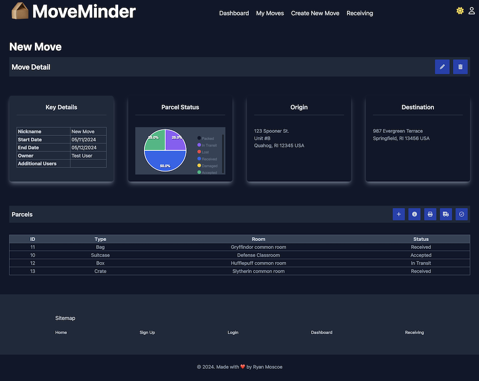

# MoveMinder

## Table of Contents
- [Table of Contents](#table-of-contents)
- [Technology Used](#technology-used)
  - [Badges](#badges)
- [Description](#description)
- [Code Examples](#code-examples)
- [Installation and Usage](#installation-and-usage)
  - [Installation](#installation)
  - [Usage](#usage)
    - [Getting Started](#getting-started)
    - [Dashboard](#dashboard)
    - [My Moves](#my-moves)
    - [New Move](#new-move)
    - [Move Detail](#move-detail)
    - [New Parcel](#new-parcel)
    - [Parcel Detail](#parcel-detail)
    - [Receiving](#receiving)
- [Learning Points](#learning-points)
  - [Django Generic Views](#django-generic-views)
  - [Django Forms](#django-forms)
  - [Django Template Language](#django-template-language)
  - [Webcam](#webcam)
  - [Amazon Web Services](#amazon-web-services)
- [Author Info](#author-info)
  - [Ryan Moscoe](#ryan-moscoe)
- [Future Development](#future-development)
- [License](#license)
- [Contributing](#contributing)

<br/>

## Technology Used 

| Technology Used         | Resource URL           | 
| ------------- |:-------------:| 
| Python | [https://www.python.org/](https://www.python.org/) |
| Django | [https://www.djangoproject.com/](https://www.djangoproject.com/) |
| Django-Phonenumber-Field | [https://django-phonenumber-field.readthedocs.io/en/latest/](https://django-phonenumber-field.readthedocs.io/en/latest/) |
| Django-PWA | [https://github.com/silviolleite/django-pwa](https://github.com/silviolleite/django-pwa) |
| Django-Tailwind | [https://django-tailwind.readthedocs.io/en/latest/](https://django-tailwind.readthedocs.io/en/latest/) |
| HTML    | [https://developer.mozilla.org/en-US/docs/Web/HTML](https://developer.mozilla.org/en-US/docs/Web/HTML) | 
| FontAwesome | [https://fontawesome.com/](https://fontawesome.com/) |
| CSS     | [https://developer.mozilla.org/en-US/docs/Web/CSS](https://developer.mozilla.org/en-US/docs/Web/CSS)      |  
| TailwindCSS |  [https://tailwindcss.com/](https://tailwindcss.com/) |
| JavaScript | [https://developer.mozilla.org/en-US/docs/Web/JavaScript](https://developer.mozilla.org/en-US/docs/Web/JavaScript) |
| Node.js | [https://nodejs.org/en](https://nodejs.org/en) |
| ApexCharts | [https://apexcharts.com/](https://apexcharts.com/) |
| PostgreSQL | [https://www.postgresql.org/](https://www.postgresql.org/)
| Git | [https://git-scm.com/](https://git-scm.com/)     |  
| GitHub | [https://github.com/](https://github.com/) |
| Green Unicorn (gunicorn) | [https://gunicorn.org/](https://gunicorn.org/) |
| Whitenoise | [https://whitenoise.readthedocs.io/en/latest/](https://whitenoise.readthedocs.io/en/latest/) |
| Amazon Web Services (AWS) | [https://aws.amazon.com/](https://aws.amazon.com/) |
| AWS Simple Storage Service (S3) | [https://aws.amazon.com/](https://aws.amazon.com/) |
| AWS Relational Database Service (RDS) | [https://aws.amazon.com/](https://aws.amazon.com/) |
| Heroku | [https://www.heroku.com/](https://www.heroku.com/) |
| Gemini | [https://gemini.google.com/app](https://gemini.google.com/app) |

<br/>

### Badges

 &nbsp; &nbsp;  &nbsp; &nbsp;  &nbsp; &nbsp; 

<br/>

## Description 

[Visit the Deployed Site](https://moveminder-tracker-f210fd4c1414.herokuapp.com/)

MoveMinder lets you track the contents and status of every box, appliance, and piece of furniture throughout a move. Create a record for each move with the date(s), origin address, and destination address. Add a record for each parcel, including its type, contents, and weight, as well as the room in which it belongs at its destination. Print labels with a QR code for each parcel, and scan the QR code to update the parcel's status. MoveMinder is a Progressive Web App (PWA), so you can install it on your mobile device, making it easy to use your mobile device as a scanner.

<br/>


<br/>

I had been sitting on the idea for this project for some time, until I found myself at a point where I needed to create a project as a way to learn Django's generic views, forms, and the Django Template Language. I chose to create this application specifically because it lent itself well to the list, detail, create, update, and delete structure of Django's generic views.

For the data layer, I opted for a PostgreSQL database, hosted on AWS RDS. Because I needed to include images in the database, I am also using AWS S3. I used Python and Django for both the back end and front end of this application, augmented by TailwindCSS for styling. Finally, I used Gemini to generate images for the homepage.

<br/>

## Code Examples

This first example demonstrates the use of the generic DetailView to create a View for parcel details. This view is slightly more complex than a typical detail view, because it also includes a form for updating the status of the parcel.


```python
class ParcelDetailView(SitemapMixin, LoginRequiredMixin, UpdateView):
    model = Parcel
    template_name = "tracker/parcel_detail.html"
    form_class = ParcelStatusForm

    def get_context_data(self, **kwargs):
        context = super().get_context_data(**kwargs)
        success = self.request.GET.get("success", None)
        if success is not None:
            context["success"] = success
        return context
    
    def get(self, request, *args, **kwargs):
        url = request.path
        user = User.objects.select_related("userprofile").get(id=request.user.id)
        history = user.userprofile.recent_pages
        for i in range(len(history)):
            if history[i]["name"] == f"Parcel Detail: {self.get_object().id}":
                history.pop(i)
                break
        history.insert(0, { "name": f"Parcel Detail: {self.get_object().id}", "url": url})
        while len(history) > 10:
            history.pop()
        user.userprofile.recent_pages = history
        user.userprofile.save()
        return super().get(request, *args, **kwargs)
    
    def get_success_url(self):
        url = reverse("tracker:parcel-detail", kwargs={'move_id': self.get_object().move_id.id, 'pk': self.get_object().id})
        url += "?success=true"
        return url
```

The following example shows a Form. I extended Django's built-in User model, so the signup and update forms needed to seamlessly merge the User model with my Userprofile model. I also needed to override the clean() method to account for dual password fields that both related to the single `password` field in the User model.

```python
class UpdateUserForm(ModelForm):
    password1 = forms.CharField(label="Password", widget=forms.PasswordInput, required=False)
    password2 = forms.CharField(label="Confirm Password", widget=forms.PasswordInput, required=False)
    phone = PhoneNumberField()

    class Meta:
        model = User
        fields = ["username", "password1", "password2", "first_name", "last_name", "email", "phone"]

        def __init__(self, *args, **kwargs):
            self.user = kwargs.get("instance", None)
            super().__init__(*args, **kwargs)

            self.fields["username"].initial = self.user.username
            self.fields["first_name"].initial = self.user.first_name
            self.fields["last_name"].initial = self.user.last_name
            self.fields["email"].initial = self.user.email

        def clean_password2(self):
            password1 = self.cleaned_data.get("password1")
            password2 = self.cleaned_data.get("password2")
            if password1 and password2 and password1 != password2:
                raise ValidationError("Passwords don't match")
            return password2

```

Finally, this example shows a portion of my parcel_update.html template. For some forms in this application, I was able to simply use the {{ form.as_div }} tag to render all form fields, including applicable help text and error messages. This particular form was more complicated, however, because it included a photo input. By default, Django renders the photo input with an Upload button, but I wanted to enable users to snap a photo with the camera on their mobile device. I needed to add a camera button, so I had to render each form field individually.

```html
    <form id="update-parcel-form" method="post" class="form-grid my-2 sm:my-3 mx-0 md:mx-auto md:my-8 rounded-md lg:rounded-lg box p-4 md:p-8 lg:p-12 xl:p-16 w-full md:w-4/5 lg:w-2/3 xl:w-1/2 box-border space-y-4 lg:space-y-6" enctype="multipart/form-data">
        <h2 class="text-center">{{ move.nickname }}: Update Parcel</h2>
        
        <div class="fieldWrapper">
            {{ form.type.as_field_group }}
        </div>
        <div class="fieldWrapper">
            {{ form.room.as_field_group }}
        </div>
        <div class="fieldWrapper">
            {{ form.contents.as_field_group }}
        </div>
        <div class="fieldWrapper">
            <label class="block" for="{{ form.photo.id_for_label }}">
                <span>Photo:</span>
            </label>
            <div class="flex flex-wrap justify-between space-x-2 lg:space-x-3 items-center">
                {{ form.photo }}
                <div class="flex mt-2 items-center space-x-2">
                    <span>&nbsp;or&nbsp;</span>
                    <button id="camera-button" class="btn-square primary">
                        <i id="camera-icon" class="fa fa-camera"></i>
                        <svg id="spinner" class="hidden animate-spin size-5 text-white dark:text-slate-300" xmlns="http://www.w3.org/2000/svg" fill="none" viewBox="0 0 24 24">
                            <circle class="opacity-25" cx="12" cy="12" r="10" stroke="currentColor" stroke-width="4"></circle>
                            <path class="opacity-75" fill="currentColor" d="M4 12a8 8 0 018-8V0C5.373 0 0 5.373 0 12h4zm2 5.291A7.962 7.962 0 014 12H0c0 3.042 1.135 5.824 3 7.938l3-2.647z"></path>
                        </svg>
                    </button>
                </div>
            </div>
        </div>
        <div class="fieldWrapper">
            {{ form.weight.as_field_group }}
        </div>
        <div class="fieldWrapper">
            {{ form.status.as_field_group }}
        </div>
        <div>
            
                <div>
                    <p class="text-red-500 dark:text-red-600 text-sm md:text-base">Please correct the following errors:</p>
                    <ul class="errorlist">
                        
                            
                                <li>{{ field }}: {{ error }}</li>
                            
                        
                    </ul>
                </div>
            
            <div class="flex flex-wrap justify-between pt-3">
                <a href="" class="btn primary subtle">Cancel</a>
                <input type="submit" value="Submit" class="btn primary" />
            </div>
        </div>
    </form>
```

<br/>

## Installation and Usage 

### Installation

Because MoveMinder is a web application, you do not need to install it. You do have the **option** to install it, though, because it is a PWA.
1. Visit [MoveMinder](https://moveminder-tracker-f210fd4c1414.herokuapp.com/) in any modern web browser. Alternatively, to install the app and have it open directly to the Receiving page, visit [Receiving Page](https://moveminder-tracker-f210fd4c1414.herokuapp.com/parcels/receiving/).
2. Click the *Install* icon in the address bar. In Chrome, it looks something like this:

<br/>


<br/>

### Usage

#### Getting Started

Click the `Get Started` button on the homepage to sign up for a user account. After signing up, you will be prompted to log in. Navigating MoveMinder is intended to be straightforward, and you should be able to reach pretty much any page within one or two clicks from anywhere in the application. On large screens, the header contains the primary navigation links, and many of the figures that follow show the header. On small screens, a drawer on the left-hand side of the application replaces the navigation links in the header (see below).

<br/>


<br/>

#### Dashboard

Once logged in, you will see the Dashboard. The Dashboard is the central hub of the application. As shown below, it grants access to all other pages within the application, and it displays key information at a glance: your upcoming moves and a pie chart showing the status of all parcels across all your moves. You can click any upcoming move or recently viewed page to navigate to that page.

<br/>


<br/>

#### My Moves

The My Moves page shows a list of all your moves, past and future. Click on any move to view its details, or click the `Create New Move` button to add a move. The screenshot below shows the My Moves page, and it also shows another feature of the application: dark mode. Toggle dark mode on or off with the moon/sun icons in the header.

<br/>


<br/>

#### New Move

The figure below shows the New Move page. All MoveMinder forms are designed with a consistent look and feel.

<br/>


<br/>

#### Move Detail

The Move Detail page shows the dates and other details of a single move, as well as the origin and destination addresses. It also includes a pie chart that shows the status of all parcels for that move, and finally, a list of all parcels in that move. Buttons at the top of the Move Detail page allow you to edit or delete the move.

<br/>



<br/>

Another set of buttons above the Parcels table lets you create a new parcel or take action on all parcels for that move at once:
* **Add**: Add a new parcel to the move.
* **Info**: Reveal a card with instructions for the remaining buttons on this screen.
* **Print**: Print labels for all parcels in this move.
* **Bulk Ship**: Set the status of all "Packed" parcels to "In Transit." You always have the option to scan each parcel and update its status individually when loading the parcel into your vehicle or turning it over to a moving company, but the Bulk Ship option is intended to provide a more efficient option.
* **End Receiving**: Set the status of all parcels not "Received," "Damaged," or "Accepted" to "Lost." This button is intended for use after scanning all parcels received from movers or unloaded from your vehicle. Essentially, any parcel you have not received after your move is lost, and the End Receiving button provides a convenient way to update the status of these parcels without having to find each one in your list of parcels and update its status individually.

<br/>

#### New Parcel

As shown below, the New Parcel page lets you add a parcel to your move. Choose a parcel type (e.g., bag, box, furniture) and enter any optional details. You may also take a picture of the parcel's contents or upload a photo, if desired.

<br/>


<br/>

#### Parcel Detail

If you uploaded a photo of the parcel or its contents, the Parcel Detail page shows that photo. In addition, this page shows the parcel's status, contents, and details, and lets you update the status. It also includes a set of buttons at the top of the page. Whereas the buttons on the Move Detail page apply actions to all parcels for that move, the buttons on the Parcel Detail page apply actions to the current parcel only:
* **Info**: Reveals a card with information about the other buttons.
* **Print**: Prints the label for the current parcel.
* **Edit**: Lets you edit the parcel details.
* **Delete**: Deletes the current parcel.

<br/>


<br/>

Open the Status menu and select an option to change the parcel's current status:
* **Packed**: The parcel is ready for shipment but has not yet been loaded onto a vehicle or provided to a moving company.
* **In Transit**: The parcel has been loaded onto a vehicle or provided to a moving company but has not yet been received at the destination.
* **Lost**: The parcel never arrived at its destination.
* **Received**: The parcel has arrived at its destination and is once again in your custody. You have not yet determined whether it arrived in good condition.
* **Damaged**: The parcel arrived at its destination but was damaged en route.
* **Accepted**: The parcel arrived at its destination in the same condition in which it departed its point of origin.

After selecting a status, remember to click the `Submit` button to save the status update. The figure below shows a confirmation of a successful status update.

<br/>


<br/>

#### Receiving

You may use the Camera app on your mobile device or the Receiving page in MoveMinder to scan the QR code on the label for any parcel. The figure below shows the Receiving page on a mobile device.

<br/>


<br/>

When a QR code is detected, either by the Camera app or the MoveMinder Receivng page, you will be taken to the MoveMinder Receiving page, where the camera feed will be replaced by the identifying details for the parcel and a series of buttons, as shown in the figure below:
* **Received**: This is the primary action for this screen, so the button is quite large. Click or tap this button to change the status of the parcel to "Received."
* **Exit**: Click or tap "Exit" to return to the Dashboard page without updating the status of this parcel.
* **Retry**: Click or tap "Retry if the parcel details do not match the label, indicating the QR code was not read correctly. The camera feed will return and scanning will resume.
* **Damaged**: If there is obvious damage to the parcel, you may change its status to "Damaged" instead of "Received."
* **Accepted**: In some cases, you may not need to open a box to know the parcel arrived safely. For example, it may be obvious that a piece of furniture was not damaged en route. You may update the parcel's status to "Accepted" instead of "Received."

<br/>


<br/>

## Learning Points 

### Django Generic Views

My previous work with Django involved standard class-based views inheriting from `django.views.View`. For this project, I created views by subclassing TemplateView, ListView, DetailView, CreateView, UpdateView, and DeleteView. Getting started with generic views is a little tricky, because instead of defining GET, POST, PUT/PATCH, and DELETE methods, you basically feed the view some information (like which template and/or form to use), and the rest happens under the hood. That's great if you're only trying to do exactly what the parent view class is designed to do--like display a list of items or details for a single item. But many of my views were more complex. For example, the Move Detail page had to display not only the details for a single move, but also a list of all the parcels associated with that move. 

To customize the behavior of a view, you have to override one or more methods. This takes a little getting used to--but now that I know what I'm doing, it's quite a bit easier to use generic views than standard views for any view that renders a template. There's no going back! However, the DeleteView is decidedly less useful than other generic views, because it requires a separate template and a separate URL path for a delete confirmation. Conventionally, a delete confirmation is just a modal, not a whole separate page. Likewise, in a few places, I found that I needed a URL path and view that did not render a template; the user was going to stay on the same page but interact with the server in some way. I used traditional views for these cases (for example, when the user clicks the `End Receiving` button, the user stays on the Move Detail page, but I need a way to communicate with the server in order to update the status of the parcels).

<br/>

### Django Forms

Forms provide the context that enables a view to render a template with form fields, and they provide the logic to validate and sanitize form data when it is submitted. There was nothing particularly challenging about using Django forms; I had just never done it before, so it was a learning experinece for me.

<br/>

### Django Template Language

The Django Template Language itself is quite similar to other template engines I have used, such as Handlebars (for Express) and HEEX (HTML Embedded EliXir for Elixir/Phoenix), and in fact, it is noticeably simpler than some. However, there is one major quirk to Django templates. Other template engines I have used start with the highest-level template and embed pages and partials within that template. Django starts at the page level, and the page template has to declare that it "extends" a higher-level template (e.g., "base.html"). Yet templates can also "include" lower-level templates (e.g., partials).

<br/>

### Webcam

I had never worked with media input devices (cameras, microphones) until I created this application. It turned out to be relatively simple to control the camera, but capturing a frame from the video feed (taking a picture) is more complex than I anticipated. This is a new skill I can now proudly say I possess. I also had to learn some related skills, like how to generate QR codes, how to write a save hook in the Django ORM, and how to read a QR code from an image.

<br/>

### Amazon Web Services

I had previous experience with some parts of AWS, such as S3, EC2, and DynamoDB. However, for this application, I needed to learn RDS in order to host a PostgreSQL database on AWS and access that database from a web application not hosted on EC2. Because I am storing QR codes and parcel images in the database, I also needed to learn how Django, PostgreSQL, RDS, and S3 all work in concert to make that happen.

<br/>

## Author Info

### Ryan Moscoe 

* [Portfolio](https://rmoscoe.github.io/my-portfolio/)
* [LinkedIn](https://www.linkedin.com/in/ryan-moscoe-8652973/)
* [Github](https://github.com/rmoscoe)

<br/>

## Future Development

Because this is a portfolio project, there are no specific plans for additional development. However, if and when time allows, I might periodically add features or fix bugs. Examples of features that ***may*** be added over time include
* Groups. This would allow an organization or family to include specific users as members. Roles and permissions could then be assigned accordingly, and visibility to other users could be limited to the group. For example, if a user creates a group, the user could then create other user accounts within that group or provide a group name or ID to individuals to use when signing up for an account. When adding users to a move, each user would only be able to see and select other users within their group.
* Account deactivation/deletion. This would allow a user to deactivate or delete his or her account.
* Moving company model. This would allow move details to include the name of the moving company being used for the move. The moving company model would also include contact information for the moving company.
* Resources. This would be a separate page (but would also be represented on the Dashboard in some way) with helpful information, such as blog posts, videos, and links, related to moving. Topics could include how to select the right moving company, how best to pack different kinds of items, considerations for interstate and international moves, strategies for recovering losses from damaged and lost parcels, and so on.

<br/>

## License

See repo for license information.

<br/>

## Contributing

Because this is a portfolio project, I am not accepting contributions at this time. However, feel free to fork this repo and create your own version.